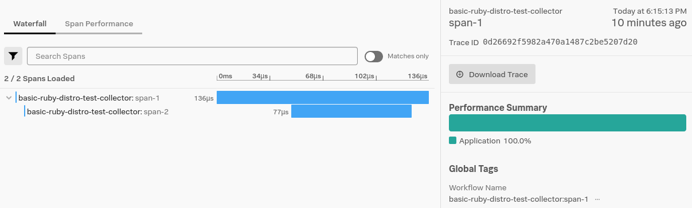
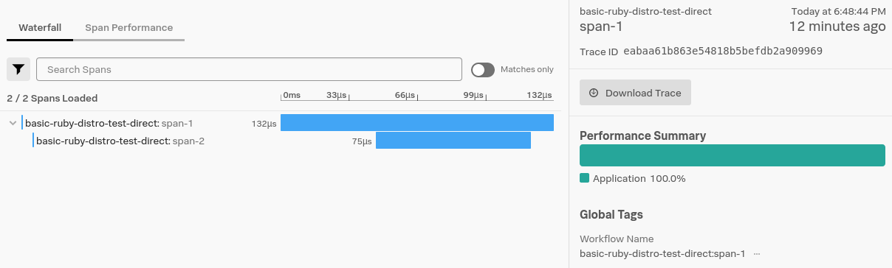

# Basic Splunk Otel Distro example

The `console.rb` script will use the `splunk-otel` gem from the root of this repo
as the dependency.

Run the script and the function `BasicExample.some_spans` to create a couple spans and logs.

``` shell
$ ./console.rb
irb(main):001:0> BasicExample.some_spans
service.name=unnamed-ruby-service trace_id=01300273775f7550bf4af9f46097afd9 span_id=26737fe11ff026a5 : show log correlation
=> true
```

### Export to console

The environment variable `OTEL_TRACES_EXPORTER` can be set to `console` to see
the spans printed to the console when exported:

``` shell
$ OTEL_TRACES_EXPORTER=console ./console.rb
service.name=unnamed-ruby-service trace_id=2c9a43b23a08163e4a25c8e3736c7bda span_id=43d59546e5d1b434 : show log correlation
#<struct OpenTelemetry::SDK::Trace::SpanData
 name="span-2",
 ...
 parent_span_id="\x96\xDD\xC3&\xEE\xAE\xCB:",
 ...
 instrumentation_library=
  #<struct OpenTelemetry::SDK::InstrumentationLibrary
   name="mytracer",
   version="">,
 span_id="C\xD5\x95F\xE5\xD1\xB44",
 trace_id=",\x9AC\xB2:\b\x16>J%\xC8\xE3sl{\xDA",
 ...>
#<struct OpenTelemetry::SDK::Trace::SpanData
 name="span-1",
 ...
 parent_span_id="\x00\x00\x00\x00\x00\x00\x00\x00",
 ...
 instrumentation_library=
  #<struct OpenTelemetry::SDK::InstrumentationLibrary
   name="mytracer",
   version="">,
 span_id="\x96\xDD\xC3&\xEE\xAE\xCB:",
 trace_id=",\x9AC\xB2:\b\x16>J%\xC8\xE3sl{\xDA",
 ...>
=> true
```

### Export to Splunk OTEL Collector

``` 
version: "3"
services:
  splunk-otel-collector:
    image: quay.io/signalfx/splunk-otel-collector:latest
    environment:
    - SPLUNK_ACCESS_TOKEN=${SPLUNK_ACCESS_TOKEN}
    - SPLUNK_REALM=${SPLUNK_REALM}
    ports:
    - "4318:4318"
```

From this (`examples/basic`) directory bring up the [Splunk OpenTelemetry Collector](https://github.com/signalfx/splunk-otel-collector):

``` shell
$ SPLUNK_ACCESS_TOKEN=<ACCESS TOKEN> SPLUNK_REALM=<REALM> docker-compose up
```

Run the example again:

``` 
$ OTEL_SERVICE_NAME=basic-ruby-distro-test-collector ./console.rb
irb(main):001:0> BasicExample.some_spans
service.name=basic-ruby-distro-test-collector trace_id=0d26692f5982a470a1487c2be5207d20 span_id=64573df1bef69199 : show log correlation
```



### Direct export to Splunk

The default exporter is `otlp` and can be used to export directly to Splunk by
setting `SPLUNK_ACCESS_TOKEN` to a token for the organization you wish to export
spans to:

``` shell
$ OTEL_SERVICE_NAME=basic-ruby-distro-test-direct SPLUNK_ACCESS_TOKEN=<ACCESS TOKEN> ./console.rb
irb(main):001:0> BasicExample.some_spans
service.name=basic-ruby-distro-test-direct trace_id=754ecd93f0254ef5995e10a854dc47ad
span_id=8d6c02874000469b : show log correlation
=> true
```


